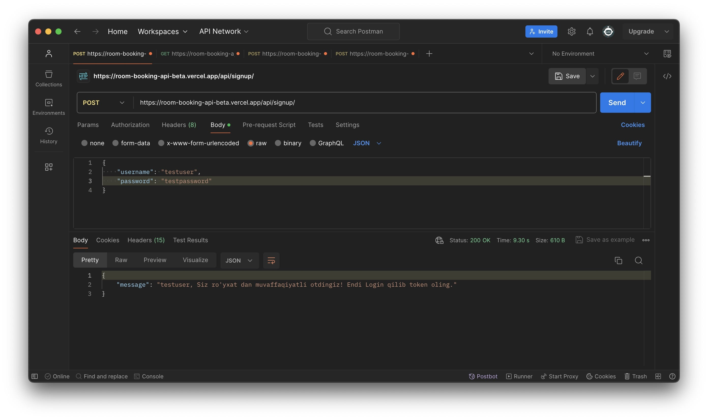
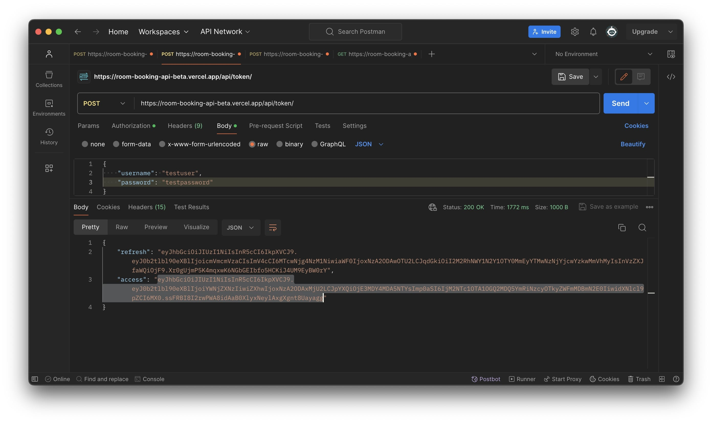
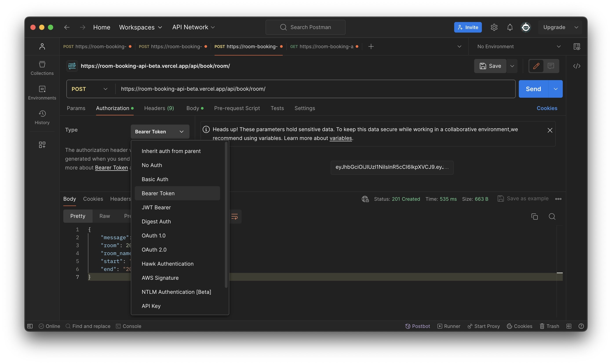
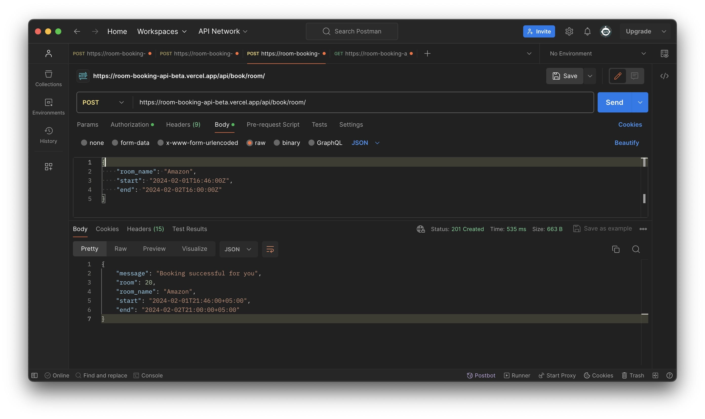
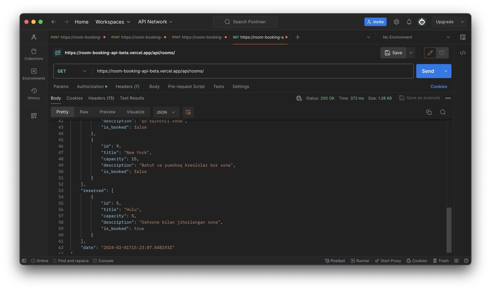

# RoomBooking_Api


> Этот API для бронирования комнатов. Смотря на вышу вкус можете добавлять комнаты через админ панель. Сейчас программа с несколько данными в `vercale` сервере есть через этот линк вы можете посмотерь - [room-booking-api](https://room-booking-api-beta.vercel.app/api/signup/).







**Пример программы так работает.**

## `Endpoints:`
- `GET` → `…/api/rooms` для свободных и занятых комнат. 

```json
{
    "available": [
        {
            "id": 1,
            "title": "Facebook",
            "capacity": 5,
            "description": "5 kishilik meeting xona",
            "is_booked": false
        },
        {
            "id": 2,
            "title": "Google",
            "capacity": 1,
            "description": "1 kishilik katta va shinam xona",
            "is_booked": false
        },
        {
            "id": 4,
            "title": "Netflix",
            "capacity": 10,
            "description": "kinoteatrli va co-working xona",
            "is_booked": false
        },
        {
            "id": 6,
            "title": "McDonald's",
            "capacity": 30,
            "description": "O’yinchoqlarga boy xona",
            "is_booked": false
        },
        {
            "id": 7,
            "title": "Halloween",
            "capacity": 1,
            "description": "qo’rqinchli xona",
            "is_booked": false
        },
        {
            "id": 9,
            "title": "New York",
            "capacity": 15,
            "description": "Batut va yumshoq kreslolar bor xona",
            "is_booked": false
        }
    ],
    "reserved": [
        {
            "id": 5,
            "title": "Hulu",
            "capacity": 5,
            "description": "Oshxona bilan jihozlangan xona",
            "is_booked": true
        },
        {
            "id": 3,
            "title": "Amazon",
            "capacity": 20,
            "description": "20 kishilik kichik office xona",
            "is_booked": true
        }
    ],
    "date": "2024-02-01T15:59:18.785944Z"
}
```

- `POST` → `…/api/book/room` для брона. комнаты

```json
{
    "room_name": "Facebook",
    "start": "2023-01-01T15:30:00Z",
    "end": "2023-01-01T16:30:00Z"
}
```

- `GET` → `…/api/room/<room_name>` для получения информацию о комнаты.
```json
HTTP 200 OK
Allow: GET
Content-Type: application/json

{
   "room" : 2, 
   "room_name" : "Google",
   "is_free" : true, 
   "description": "1 kishilik katta va shinam xona",
}
```

## Authentication

> Установлено JWT authentication к программу, вы должны брать токен и с помощью него сможете работать и должны проходить регистрацию иначе с программой не сможете работать.

## `Enpoints JWT:`

- `..api/token/`
- `api/token/refresh/`

## `Enpoint Sign Up:`
- `.../api/signup/`


## Установка pipenv

1. Убедитесь, что Python установлен на вашем компьютере.
2. Установите pipenv с помощью команды:
    ```
    $ pip install pipenv
    ```
3. Установите зависимости, запустив `pip install -r requirements.txt`

### Клонирование проекта и установка зависимостей

1. Клонируйте репозиторий:
    ```
    $ git clone https://github.com/Humoyun004/RoomBookin_Api.git
    ```
2. Заходите в репозиторий:
    ```
    cd RoomBooking_Api
    ```

3. Запустите команду `pipenv install`, чтобы создать виртуальное окружение и установить все зависимости из файла `Pipfile.lock`.

### Работа с проектом

- Для активации виртуального окружения запустите:
    ```
    pipenv shell
    ```
- Для установки новых зависимостей выполните:
    ```
    pipenv install <название_пакета>
    ```
- Чтобы запустить скрипты или приложение из вашего проекта, используйте `pipenv run`.


## Вклад
**Если вы хотите внести свой вклад в развитие приложения  пожалуйста, следуйте этим шагам:**

1. Форкните репозиторий на GitHub.
2. Клонируйте ваш форк репозитория на локальную машину.
3. Создайте новую ветку для вашей функции или исправления ошибки.
4. Внесите изменения и сделайте коммиты с описательными сообщениями.
5. Отправьте ваши изменения в ваш форк репозитория.
6. Создайте pull request (запрос на включение) в основной репозиторий.

## Контакты
**Если у вас есть вопросы или предложения относительно приложения, пожалуйста, свяжитесь с нами по адресу `humoyunakbaraliev1@gmail.com`. Мы ценим ваше мнение!**


